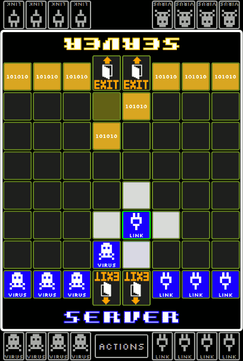
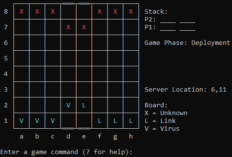

# AccessBattle

This is a free non-commercial implementation of the game 
"Rai-Net Access Battlers" which was originally released 
by the Japanese company '5pb.'. 
AccessBattle is a private fan project and not affiliated with
'5pb.' in any way.

## Status

- Current status: Work in progress
  - Multiplayer is in alpha. There are some bugs and features are missing.
  - Singleplayer is in alpha. The AI plugin contains two stupid AI opponents.
  - Singleplayer and AI vs AI is also available as a console program.
  
- Roadmap
  - ~~User Interface + Multiplayer finished: January 2018~~ (Postponed for now)
  - Singleplayer: Add more AI opponents. Next one is probably a neural network (WIP).
  - Documentation: August 2018 (if I have some free time)
  - Sorry if this is taking so long. I have a full time job and not much free time.
  
- Known Issues:
  - Same user can login multiple times. Not sure if bug or feature.  
  - Game might screw up if one client disconnects
  - Rematch does not work sometimes
  - Exit Game does not work in single player
  
- TODO
  - Interface for user database plugins
  - Ping Server, reconnect if required
  - Cleanup inactive games and logins, KeepAlive packets
  - Matchmaking for random matches
  

## Program Structure
  
The main game engine is inside a separate DLL so that people
can program their own user interface for it. The DLL should
be compatible with Mono and also run on Linux.

The main user interface is implemented with WPF using .NET 4.5.
You need at least Windows Vista SP2, Windows 7 SP1 or newer 
to use it. I tested it on Windows 7.

The code is currently a complete mess. I am focusing on
making the game run. When it does I will clean it up
and add some documentation.

Here is an example of a console based UI:

## Third Party Notices

This program uses the following external sources.
- Silkscreen font by Jason Kottke
- Newtonsoft.Json by James Newton-King

Warning! This program uses encryption for the connection to the server. Please check if this is legal in your country before using this program.

## Other Notices

**I'm NOT taking donations of any kind.**

**I do not accept pull requests until I have released version 1.0.**

## Special thanks
5pb. and Nitroplus for creating Steins;Gate

## License
**This software is GPL v3 licensed! If you use any of the code you must release your code under GPL v3 as well.**